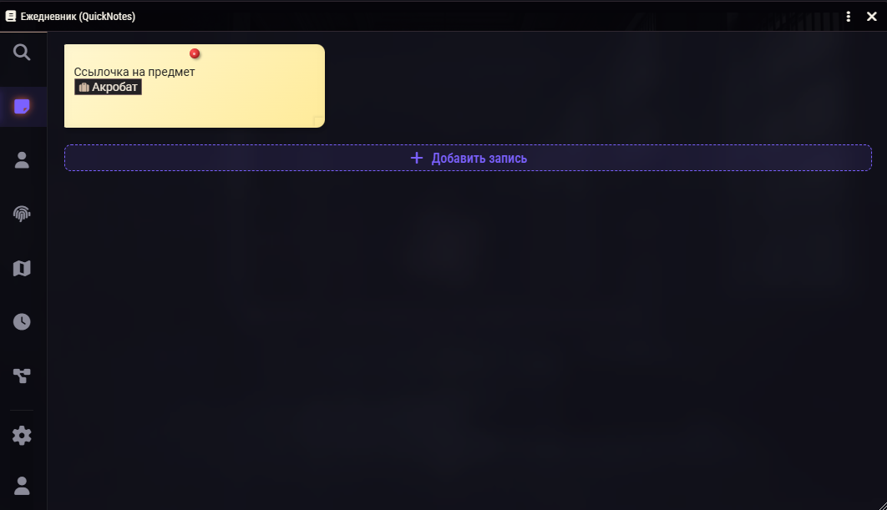
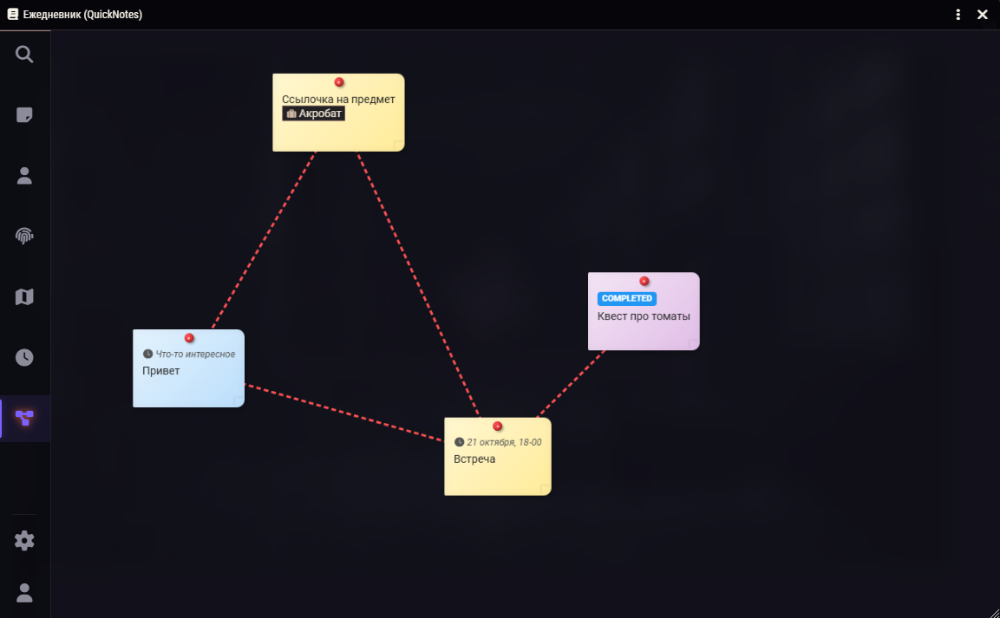
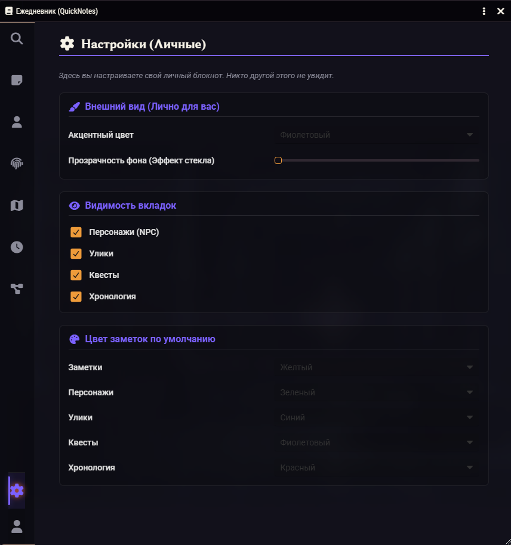

# ClueBook (Ежедневник детектива)

**ClueBook** — это легковесный, быстрый и невероятно удобный модуль-блокнот для Foundry VTT (v12+), созданный для расследований, детективных игр и просто для структурирования информации в кампаниях.

*(Замените этот плейсхолдер на скриншот главного окна модуля)*

## ✨ Главные возможности

- **🗂️ Удобная категоризация:** Раздельные вкладки для Заметок, Персонажей (NPC), Улик, Квестов и Хронологии.
- **🕸️ Интерактивная доска:** Выносите любые записи на бесконечный холст, свободно перемещайте их и связывайте нитями, как настоящие детективы.
- **🤝 Общий доступ:** Переключайтесь между личным блокнотом (видите только вы) и общим журналом (видят все игроки). Настраивайте общую доску вместе!
- **🎨 Полная кастомизация:** Встроенная вкладка настроек позволяет каждому игроку менять акцентный цвет интерфейса, прозрачность окон (эффект стекла) и отключать ненужные вкладки.
- **⚡ Молниеносная работа:** Написан на современном Application V2. Мгновенное автосохранение, глобальный умный поиск и отсутствие лагов.

## 📸 Скриншоты

### Интерактивная доска расследований

*(Замените этот плейсхолдер на скриншот доски с уликами и связями)*

### Вкладка настроек и кастомизация

*(Замените этот плейсхолдер на скриншот окна настроек)*

## Установка

1. В Foundry VTT откройте вкладку Add-on Modules.
2. Нажмите Install Module.
3. Вставьте ссылку на `module.json` этого репозитория:
   `https://raw.githubusercontent.com/pauk27000-commits/ClueBook/main/module.json`
4. Установите и активируйте в вашем мире!
